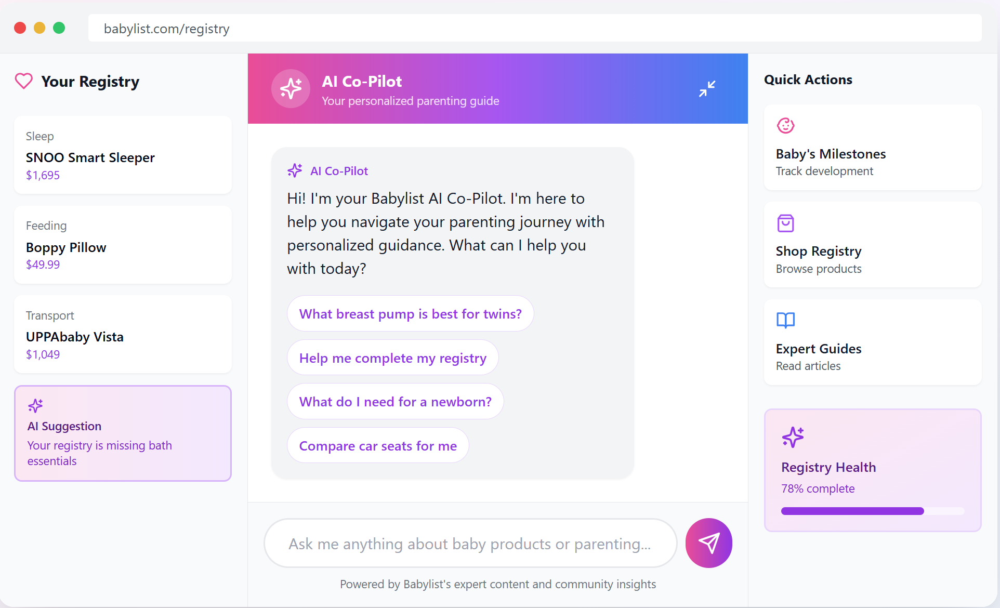

# Registry AI Copilot: Conversion Architecture

**The Problem:** Users start a registry, get stuck comparing products, then leave. Incomplete registry = lost revenue.

**Why They Get Stuck:** Too many similar yet different products. No guidance on what's right for *their* situation.

**The Solution:** An AI copilot that asks a few situational questions ("Twins? Budget? Must-have features?") and instantly recommends the best 3 products – filtered for fit AND optimized for margin.

**Top 4 GTM metrics this Improves:**
- Registry completion rate ↑
- Items per registry ↑
- Time to purchase ↓
- Margin per registry ↑

**What I designed:**
- Conversation flow: awareness → comparison → purchase (GTM funnel mapped to chat)
- Dual optimization: user fit + margin priority
- Registry health score (creates urgency to complete)
- Gap detection (surfaces missed categories for upsell)

**Key design decisions + trade-offs:**

| Decision | Trade-off |
|----------|-----------|
| **Conversation flow:** maps awareness → comparison → purchase (GTM funnel to chat) | Open prompts keep it consultative, not a wizard |
| **Dual optimization:** prioritizes fit first, margin second | Reversed order and parents feel sold to, not guided |
| **Registry health score:** creates urgency to complete | "78% complete" motivates — "missing 22%" overwhelms |
| **Gap detection:** surfaces missed categories for upsell | Timed post-recommendation — too early reads as push |
| **Brand fidelity:** mirrors Babylist's tone, visuals, and trust signals | Invisible integration builds trust, not friction |

**Skills Demonstrated:**
- GTM strategy: AI as conversion and margin engine
- Prompt design for commercial outcomes
- Product thinking: user decision friction mapped to revenue levers
- End-to-end prototype (React + Claude API)

**Built With** `React` `Claude API`

*Independent portfolio concept. Not affiliated with or endorsed by Babylist.* 
